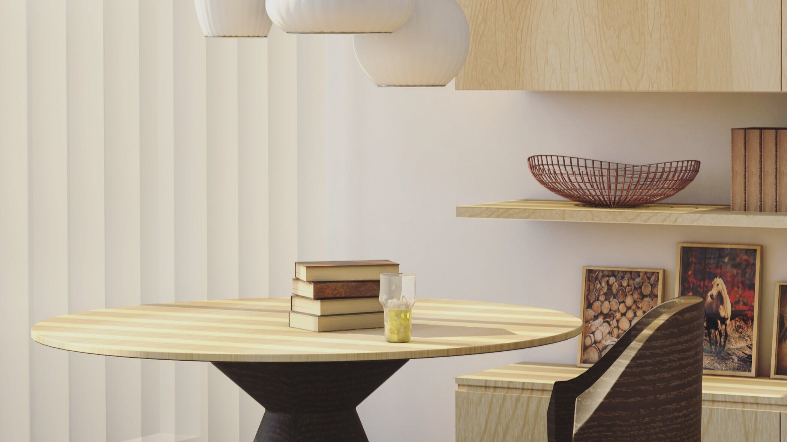

theme: minima
  

    
  

  .image-text {
  position: relative;
}

.image-text h1 {
  position: absolute;
  top: 0;
  left: 0;
  color: white;
}  <header>
    <h1>Living Spaces</h1>
  </header>
Discover the art of creating stunning living spaces with our website, where we explore the latest trends and timeless classics in home aesthetics and decor.
<html>
<body>
<a target="_blank" href="https://www.amazon.com/b?_encoding=UTF8&tag=mennayassin-20&linkCode=ur2&linkId=310ba0b4f5e37f544c42eaec549cb9a3&camp=1789&creative=9325&node=13162311">kitchen essentials to elevate your holidays</a>

  <main>
    </main>

  <footer>
    
Copyright &copy; 2023 My Website

  </footer>
</body>
</html>
